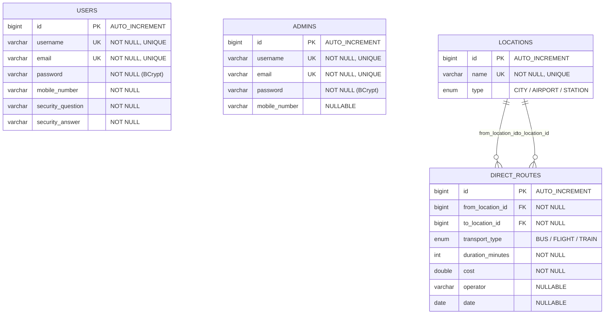

# 🗄️ OptiRoute — Database Schema

## ER Diagram



---

## Table Details

### 1. `users`

| Column | Type | Constraints | Description |
|---|---|---|---|
| `id` | `BIGINT` | **PK**, AUTO_INCREMENT | Unique user identifier |
| `username` | `VARCHAR(255)` | NOT NULL, **UNIQUE** | Display name |
| `email` | `VARCHAR(255)` | NOT NULL, **UNIQUE** | Login identifier |
| `password` | `VARCHAR(255)` | NOT NULL | BCrypt-hashed password |
| `mobile_number` | `VARCHAR(255)` | NOT NULL | Contact number |
| `security_question` | `VARCHAR(255)` | NOT NULL | For password reset |
| `security_answer` | `VARCHAR(255)` | NOT NULL | Answer to security question |

**Indexes:** PK on `id`, Unique on `email`, Unique on `username`

---

### 2. `admins`

| Column | Type | Constraints | Description |
|---|---|---|---|
| `id` | `BIGINT` | **PK**, AUTO_INCREMENT | Unique admin identifier |
| `username` | `VARCHAR(255)` | NOT NULL, **UNIQUE** | Admin login name |
| `email` | `VARCHAR(255)` | NOT NULL, **UNIQUE** | Admin email |
| `password` | `VARCHAR(255)` | NOT NULL | BCrypt-hashed password |
| `mobile_number` | `VARCHAR(255)` | NULLABLE | Contact number |

**Indexes:** PK on `id`, Unique on `email`, Unique on `username`

---

### 3. `locations`

| Column | Type | Constraints | Description |
|---|---|---|---|
| `id` | `BIGINT` | **PK**, AUTO_INCREMENT | Unique location identifier |
| `name` | `VARCHAR(255)` | NOT NULL, **UNIQUE** | City/airport/station name |
| `type` | `ENUM('CITY','AIRPORT','STATION')` | NOT NULL | Location category |

**Indexes:** PK on `id`, Unique on `name`

**Sample Data:**

| id | name | type |
|---|---|---|
| 1 | New York | CITY |
| 2 | London | CITY |
| 3 | Paris | CITY |
| 4 | Tokyo | CITY |
| 5 | Sydney | CITY |
| 6 | JFK Airport | AIRPORT |
| 7 | Heathrow Airport | AIRPORT |

---

### 4. `direct_routes`

| Column | Type | Constraints | Description |
|---|---|---|---|
| `id` | `BIGINT` | **PK**, AUTO_INCREMENT | Unique route identifier |
| `from_location_id` | `BIGINT` | **FK** → `locations.id`, NOT NULL | Source location |
| `to_location_id` | `BIGINT` | **FK** → `locations.id`, NOT NULL | Destination location |
| `transport_type` | `ENUM('BUS','FLIGHT','TRAIN')` | NOT NULL | Mode of transport |
| `duration_minutes` | `INT` | NOT NULL | Travel time in minutes |
| `cost` | `DOUBLE` | NOT NULL | Ticket price |
| `operator` | `VARCHAR(255)` | NULLABLE | Airline/bus/train operator |
| `date` | `DATE` | NULLABLE | Travel date |

**Indexes:** PK on `id`, FK index on `from_location_id`, FK index on `to_location_id`

**Sample Data:**

| id | from | to | transport | duration | cost |
|---|---|---|---|---|---|
| 1 | New York | London | FLIGHT | 420 min | $500 |
| 2 | New York | London | FLIGHT | 450 min | $350 |
| 3 | New York | London | FLIGHT | 400 min | $800 |
| 4 | London | Paris | TRAIN | 135 min | $100 |
| 5 | London | Paris | FLIGHT | 75 min | $150 |
| 6 | London | Paris | BUS | 480 min | $40 |
| 7 | New York | Tokyo | FLIGHT | 840 min | $1200 |

---

## Relationships

```
LOCATIONS (1) ──────< (Many) DIRECT_ROUTES.from_location_id
LOCATIONS (1) ──────< (Many) DIRECT_ROUTES.to_location_id
```

- **One Location → Many Routes (as source):** A single city like "New York" can be the starting point for many routes
- **One Location → Many Routes (as destination):** A single city like "London" can be the destination of many routes
- **JPA Mapping:** `@ManyToOne` + `@JoinColumn` on `DirectRoute` entity

---

## Key Design Decisions

| Decision | Reasoning |
|---|---|
| Separate `users` and `admins` tables | Different fields (admins lack security Q&A), cleaner role separation |
| `locations` as a separate table | Avoids repeating city names in every route (3NF normalization) |
| `ENUM` for `transport_type` | Fixed set of values (BUS, FLIGHT, TRAIN) — enforces data integrity |
| `ENUM` for `location_type` | Fixed categories (CITY, AIRPORT, STATION) |
| BCrypt for passwords | Industry-standard one-way hashing, salted automatically |
| `UNIQUE` on `email` & `username` | Prevents duplicate registrations |
| FK indexes auto-created | Speeds up `findByFromLocationAndToLocation()` — the core search query |
